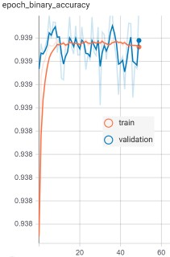

# Audio-Genre-Classification
This project was built to process audio genres multi-label classification using a Convolutional Neural Networks model.

## Environment

```
python get-pip.py
pip install -r requirements.txt
```
### Metadata Genre Analysis
For first genre occurrences analysis and reducing data imbalance, open ```Clean_metadata.ipynb```

#### Trimming audio
Opening file ```40 Seconds Files Generation.ipynb``` , you can visualize the code that was done to trim all audio tracks taking only a section of 40 seconds in the middle of each file.

##### Convolutional Neural Networks Model
To run the model you should open ```NN Model.ipynb``` 

###### Binary Accuracy and Losses Graphics



